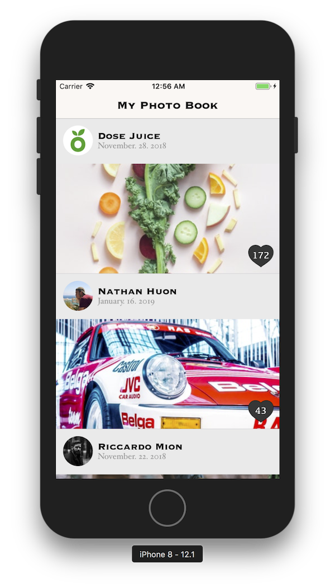
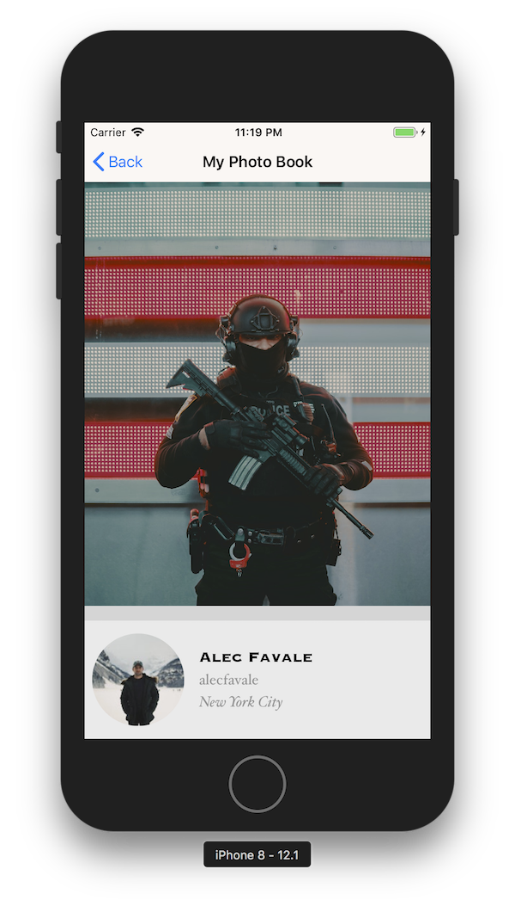
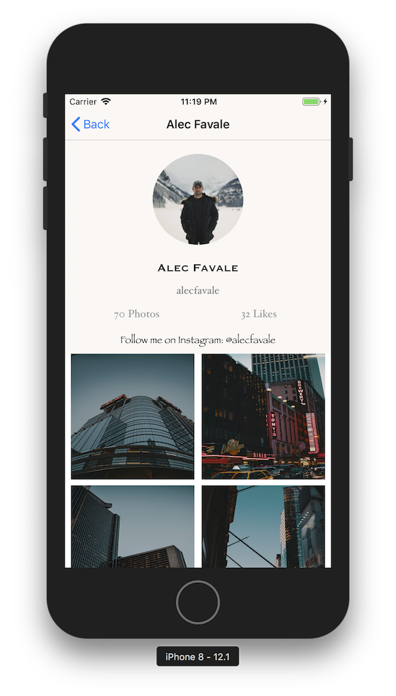

# My Photo Book Coding Challenge.

## Author:- Ankur Arya
email: <ankur.arya@me.com>

## Overview

This project contains three screens.
  - Image List Screen :- This screen shows a list of images which are fetched from server. If user scrolls to the last cell more images will be load from the server based on next-page. User can also tap on Different part of Table Cell to see different details about it.
  - Image Details Screen :- This screen shows a number of detail related to Image such as Large Image, Description (If Any), and User info who has uploaded the image.
  - User Details View :- This Screen shows a number of user details fetched from server. User can navigate to this screen either from tapping on user image or user name on Image list screen, or by tapping on User Info at the bottom of Image Details Screen.

## Architecture

This project follows Clean Architecture.
  - Interactor: Retrieves Entities and contains the business logic for a particular use case. They are view agnostic and can be consumed by one or more Presenters.
  - Presenter: Handles preparing content for the display.
  - Domain Entity: Simple data model objects.
  - Router: Handles navigation logic for which screens should appear and when.

The project is segregated into three main layers.
  - Domain: This is the core of our application. It contains Entities and Interactors.
  - Presentation: It contains presenters.
  - Application: It contains Views, Router, Network Manager, and Utils.

## Dependencies

  - This sample app require minimum iOS 12 and Xcode 10 to run.
  - This project also uses RxSwift which is added as a pod using CocoaPods.

## Screenshots

